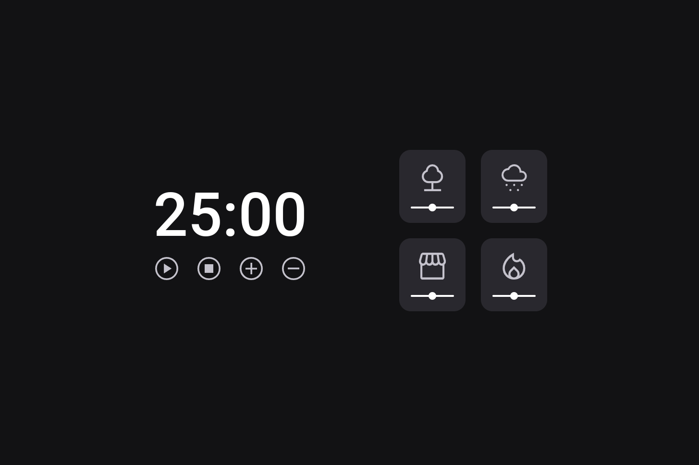

# Focus Timer 2.0

> Explorer - Stage 5

Temporozidor pomodoro com sons suaves para ajudar no foco.

Conceitos de HTML, CSS e javaScript na prática.  

Projeto construído no curso Explorer da Rocketseat Stage 5.

[Clique aqui para acessar](https://andreliciosantos.github.io/FocusTimer-2.0/)

## 🛠 Tecnologias 

- HTML
- CSS
- JavaScript
- Git e Github 

## 💛 Contato

andreliciosantos@proton.me
[Linkedin](www.linkedin.com/in/andreliciosantos)  
[Instagram](https://www.instagram.com/andreliciosantos/)